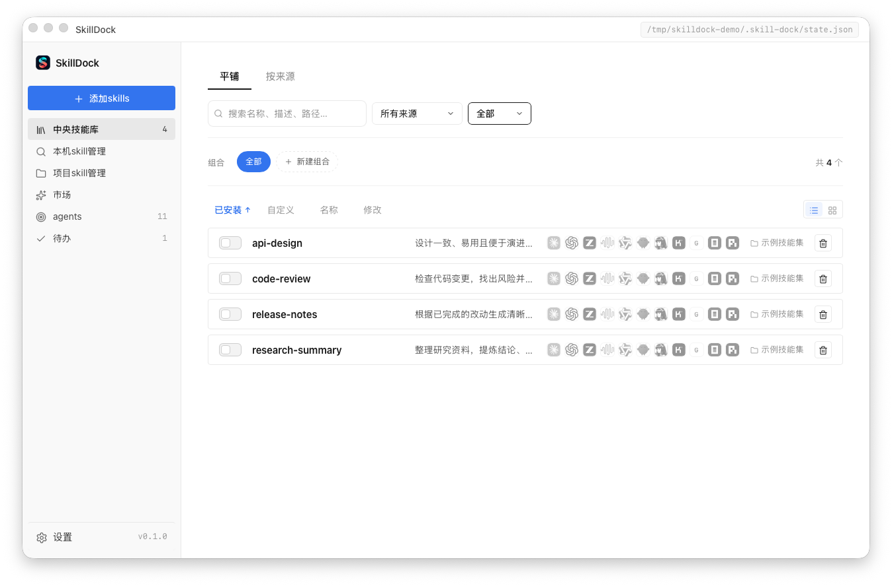

<div align="center">


# SkillDock

### 一个应用，统一管理所有 AI Agent 的 Skills

[](#)
[](#)
[](https://tauri.app)
[](#)

**[中文](README.md)** | **[English](README_EN.md)**

<p align="center">
  <a href="#主要功能">功能</a> ·
  <a href="#界面预览">界面预览</a> ·
  <a href="#架构概览">架构概览</a> ·
  <a href="#快速开始">快速开始</a> ·
  <a href="#更多文档">更多文档</a>
</p>

</div>

## SkillDock 是什么

SkillDock 是一个把散落在各个 AI Agent 目录里的技能（Skills）收拢到一个桌面工作台的统一管理工具。

本地文件夹、GitHub 仓库、技能市场里的技能都进同一个中央技能库，再以符号链接的方式安装到 Claude Code、Codex 等 38+ 个 Agent 的技能目录——磁盘上始终只有一份文件，改完即生效，卸载干净不留残余。

<a id="界面预览"></a>
## 界面预览



使用隔离的示例技能集截取，不包含个人数据。

<a id="快速开始"></a>
## 快速开始

### 下载

**macOS**：从 [Releases](https://github.com/qlql489/skill-dock/releases) 下载 `.dmg` 文件，双击安装。同时支持 Apple Silicon (arm64) 和 Intel (x86_64)。

如果 macOS 提示「无法验证开发者」或「Apple 无法检查此 App 是否包含恶意软件」，按下面步骤放行：

1. 先尝试双击打开一次，让系统弹出拦截提示
2. 打开「系统设置」→「隐私与安全性」
3. 滚动到「安全性」区域，点击「仍要打开」
4. 输入登录密码确认后，再次打开 SkillDock

「仍要打开」按钮通常只会在你第一次被拦截后的约 1 小时内出现。

**Windows**：从 [Releases](https://github.com/qlql489/skill-dock/releases) 下载 `.msi` 安装包运行。

### 从源码构建

前置要求：Node.js 18+、Rust 工具链、[pnpm](https://pnpm.io)

```sh
pnpm install
pnpm dev            # 开发模式（Vite HMR + 原生窗口）
pnpm tauri:build    # 本地打包（.app / .dmg，不含更新签名产物）
```

### 使用流程

1. 点左栏「添加skills」，选一个本地文件夹或 GitHub 仓库作为来源，应用会递归索引所有 `SKILL.md`
2. 在「agents」页确认你的 Agent 已被检测/启用（38+ 个内置目标，也可以添加自定义目录）
3. 在「技能库」点开任意技能，打开 Agent 开关即完成安装——安装是符号链接，Agent 立即可见
4. 来源有更新时会出现在「待办」，确认预览后一键应用

<a id="主要功能"></a>
## 主要功能

### 🔗 一个技能库，所有 Agent 共用
把散落在 `~/.claude/skills/`、`~/.codex/skills/` 等目录里的技能收拢到同一个中央技能库
- 本地文件夹、GitHub 仓库、`.zip` / `.skill` 压缩包三种来源，递归索引全部 `SKILL.md`
- 单行列表 / 多列卡片两种视图，按来源筛选、搜索与排序
- 启动时和每 30 分钟自动检查来源更新（本地按文件变更，GitHub 按 `git ls-remote`）
- 本地来源有文件监听，改动实时同步到所有已安装的 Agent

### 🖥 一键安装到任意 Agent
安装就是建立符号链接：磁盘上始终只有一份文件
- 内置 38+ 主流 Agent 目标：Claude Code、Codex、Trae、CodeBuddy、Kiro、Qwen Coder、Qoder、Lingma、iFlow、Kimi Code 等，启动时自动检测本机装了哪些
- 自定义 Agent：任何有技能目录的工具都能接入
- 技能卡片上点 Agent 图标角标即可为单个 Agent 装/卸；行尾开关一键全装/全卸
- 添加来源时可默认安装到所有已启用的 Agents

### 📦 技能市场
不离开应用就能发现和安装新技能
- 内置 [skills.sh](https://skills.sh)、腾讯 SkillHub、ClawHub 三个市场的搜索与热门榜单
- 一键装进中央技能库，之后与本地技能完全同等地管理、更新、分发

### 🗂 组合与待办
- 「组合」把一组技能打包，一键应用到所选 Agents，保存即同步勾选
- 「待办」页集中呈现需要处理的事：失效/冲突的软链、有更新的来源、未检测到的 Agent

### 🩺 安全的更新与卸载
- 更新检查是**被动的**：只比较远端 SHA，绝不自动拉取——因为软链直连，pull 会立即传导到每个 Agent
- 应用更新前提供 git diff 级别的预览，确认后才落盘
- 符号链接所有权保护：真实目录永不覆盖；别人的软链只在显式确认后替换
- 彻底删除会先卸干净所有软链，目录进废纸篓可恢复

### ⬆️ 应用内自动更新
- 启动后每 10 分钟静默检查新版本，发现新版在侧栏提醒
- 设置 → 应用更新 一键下载安装（带进度），重启即完成升级
- 更新包经 minisign 签名校验，拒绝被篡改的安装包

### 🎨 外观
- 六种预设主题色 + 自定义取色器，即时生效并持久化

<a id="架构概览"></a>
## 架构概览

- **桌面容器**：基于 Tauri 2.0 构建，安装体积小、启动快
- **前端界面**：Vite + 原生 TypeScript（无框架），按页面拆分视图模块
- **本地能力**：Rust 侧负责扫描、软链管理、Git 同步、市场下载与状态持久化
- **安装模型**：中央技能库 → 符号链接 → 各 Agent 目录；启动时对账（reconcile），失效/被动的链接会如实标出

## 技术栈

| 层级 | 技术选型 |
|------|----------|
| **桌面框架** | [Tauri 2.0](https://tauri.app) — 基于 Rust 的轻量级桌面框架 |
| **前端** | Vite + 原生 TypeScript（无框架） |
| **后端** | Rust（Tokio 异步运行时） |
| **Git 操作** | 系统 `git` 二进制（带超时与并发控制） |
| **市场下载** | 系统 `curl` + 安全解压 |
| **内容哈希** | blake3（用于更新检测） |
| **文件监听** | notify |
| **文档站** | VitePress + GitHub Pages |
| **自动更新** | tauri-plugin-updater（minisign 签名校验） |

## 数据目录

新安装的应用状态在 `~/.skill-dock/`。从 Skill Manager 升级时，会继续使用已有的 `~/.skill-manager/` 数据目录，确保现有配置不丢失：

- `state.json` — 来源、Agent、安装关系与组合配置
- `repos/<uuid>/` — GitHub 来源的本地克隆

技能本体永远留在来源目录，`state.json` 只记录索引和软链关系——删掉应用，技能原封不动。

## 常见问题

### SkillDock 依赖什么运行？

独立运行，无外部依赖。添加 GitHub 来源或使用技能市场时需要系统 `git` / `curl`（macOS 与主流 Linux 自带，Windows 建议安装 Git for Windows）。

### 安装技能会动我 Agent 目录里已有的东西吗？

不会。SkillDock 只创建/移除自己建立的符号链接；对真实目录永远拒绝写入，对不认识的软链只在显式确认后替换。「本机 skill 管理」页可以把已存在的技能纳入技能库管理，而不是覆盖它们。

### 支持哪些 Agent？

内置 38+ 目标（Claude Code、Codex、MiniMax Agents 默认启用，其余在「agents」页按需开启），支持自定义目录，详见 [文档](https://qlql489.github.io/skill-dock/)。

<a id="更多文档"></a>
## 更多文档

- 文档目录：[`docs/`](docs)
- 本地预览：`pnpm docs:dev`
- 在线文档：<https://qlql489.github.io/skill-dock/>

## 开发者：发布新版本

```sh
# 1. 改 package.json 的 version（唯一需要改版本号的地方）
# 2. 提交并打 tag，CI 自动构建三平台产物并生成 latest.json
git tag v0.2.0 && git push --tags
```

构建签名密钥与 GitHub secrets 的一次性配置见 [`.github/workflows/release.yml`](.github/workflows/release.yml) 头部说明。

### 作者

本软件由 [jacob](https://github.com/qlql489) 独立开发
