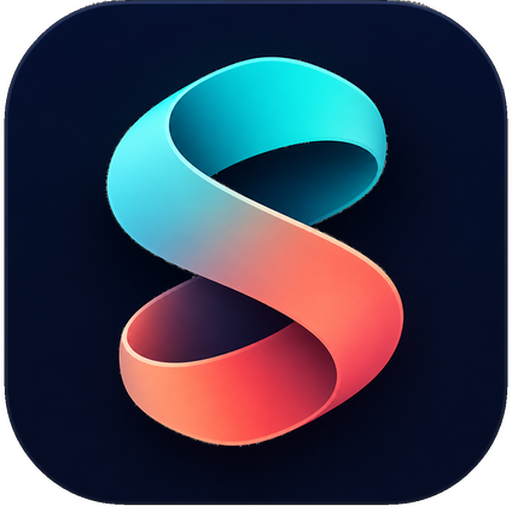

<div align="center">



# SkillDock

### One app to manage Skills for all your AI agents

[](#)
[](#)
[](https://tauri.app)
[](#)

**[中文](README.md)** | **[English](README_EN.md)**

<p align="center">
  <a href="#features">Features</a> ·
  <a href="#screenshots">Screenshots</a> ·
  <a href="#architecture">Architecture</a> ·
  <a href="#getting-started">Getting Started</a> ·
  <a href="#docs">Docs</a>
</p>

</div>

## What is SkillDock

SkillDock is a desktop workbench that unifies all the skills scattered across your AI agent directories.

Skills from local folders, GitHub repos, or skill marketplaces all land in one central library, and get installed into the skill directories of 38+ agents (Claude Code, Codex, and many more) via symlinks — there is only ever one copy of each file on disk, edits take effect instantly, and uninstalling leaves nothing behind.

<a id="screenshots"></a>
## Screenshots

<table>
  <tr>
    <td align="center" width="50%">
      
      <br />
      <b style="font-size: 16px;">Skill library: one library, shared by every agent</b>
    </td>
    <td align="center" width="50%">
      
      <br />
      <b style="font-size: 16px;">Skill detail: description + per-agent toggles</b>
    </td>
  </tr>
  <tr>
    <td align="center" width="50%">
      
      <br />
      <b style="font-size: 16px;">Marketplaces: search & leaderboards</b>
    </td>
    <td align="center" width="50%">
      
      <br />
      <b style="font-size: 16px;">Agents: browse & manage every connected agent</b>
    </td>
  </tr>
  <tr>
    <td align="center" width="50%">
      
      <br />
      <b style="font-size: 16px;">Local skills: adopt what's already on disk</b>
    </td>
    <td align="center" width="50%">
      
      <br />
      <b style="font-size: 16px;">Groups: apply a bundle of skills in one click</b>
    </td>
  </tr>
  <tr>
    <td align="center" width="50%">
      
      <br />
      <b style="font-size: 16px;">Update preview: see the diff before applying</b>
    </td>
    <td align="center" width="50%">
      
      <br />
      <b style="font-size: 16px;">Settings: appearance, sync & app updates</b>
    </td>
  </tr>
</table>

<a id="getting-started"></a>
## Getting Started

### Download

**macOS**: grab the `.dmg` from [Releases](https://github.com/qlql489/skill-dock/releases) and double-click to install. Both Apple Silicon (arm64) and Intel (x86_64) are supported.

If macOS says the app "cannot be verified" or "contains malware", allow it like this:

1. Try double-clicking the app once so the system shows the blocking dialog
2. Open "System Settings" → "Privacy & Security"
3. Scroll to the "Security" section and click "Open Anyway"
4. Enter your login password, then open SkillDock again

The "Open Anyway" button usually only appears for about an hour after the first block.

**Windows**: download the `.msi` installer from [Releases](https://github.com/qlql489/skill-dock/releases) and run it.

### Build from source

Prerequisites: Node.js 18+, the Rust toolchain, and [pnpm](https://pnpm.io)

```sh
pnpm install
pnpm dev            # dev mode (Vite HMR + native window)
pnpm tauri:build    # local package (.app / .dmg, no updater artifacts)
```

### Typical workflow

1. Click "Add skills" in the sidebar and add a local folder or GitHub repo as a source — every `SKILL.md` gets indexed recursively
2. In the "agents" page, confirm your agents are detected/enabled (38+ built-in targets, or add any custom directory)
3. Open any skill in the library and flip an agent toggle — installation is a symlink, visible to the agent immediately
4. When a source has updates it shows up in "Pending"; review the preview and apply in one click

<a id="features"></a>
## Features

### 🔗 One library, every agent
Collect skills scattered across `~/.claude/skills/`, `~/.codex/skills/` and friends into a single central library
- Three source types: local folders, GitHub repos, and `.zip` / `.skill` archives — all indexed recursively
- Row list / multi-column card views, with per-source tabs, search and sorting
- Update checks at launch and every 30 minutes (file changes for local sources, `git ls-remote` for GitHub)
- Local sources are file-watched, so edits reach every installed agent in real time

### 🖥 Install anywhere in one click
Installing is just a symlink: one copy of each file on disk
- 38+ built-in agent targets: Claude Code, Codex, Trae, CodeBuddy, Kiro, Qwen Coder, Qoder, Lingma, iFlow, Kimi Code and more — auto-detected at launch
- Custom agents: any tool with a skill directory can be connected
- Click an agent badge on a skill card to install/uninstall for that one agent; the row toggle installs/uninstalls everywhere
- Optionally default new sources to "install to all enabled agents"

### 📦 Skill marketplaces
Discover and install skills without leaving the app
- Search and trending leaderboards for [skills.sh](https://skills.sh), Tencent SkillHub and ClawHub
- One-click install into the central library; from then on they are managed exactly like local skills

### 🗂 Groups & pending items
- "Groups" bundle a set of skills and apply them to selected agents in one click
- The "Pending" page gathers everything that needs attention: broken/conflicting symlinks, sources with updates, undetected agents

### 🩺 Safe updates & uninstall
- Update checks are **passive**: only remote SHAs are compared, never auto-pulled — with direct symlinks a pull would propagate instantly to every agent
- Updates ship with a git-diff-level preview; nothing changes until you confirm
- Symlink ownership protection: real directories are never overwritten; foreign symlinks are only replaced after explicit confirmation
- "Delete forever" uninstalls every symlink first and moves the folder to the trash, recoverable

### ⬆️ In-app auto-update
- Silent update checks every 10 minutes after launch
- Settings → App update: one-click download & install with progress; a relaunch finishes the upgrade
- Update packages are verified with a minisign signature

### 🎨 Appearance
- Six preset accent colors plus a custom color picker; applied instantly and persisted

<a id="architecture"></a>
## Architecture

- **Desktop shell**: built on Tauri 2.0 — small binary, fast startup
- **Frontend**: Vite + vanilla TypeScript (no framework), one view module per page
- **Local capabilities**: the Rust side handles scanning, symlink management, Git sync, marketplace downloads and state persistence
- **Install model**: central library → symlink → each agent directory; startup reconciliation flags broken/passive links honestly

## Tech Stack

| Layer | Technology |
|-------|------------|
| **Desktop framework** | [Tauri 2.0](https://tauri.app) — lightweight Rust-based desktop framework |
| **Frontend** | Vite + vanilla TypeScript (no framework) |
| **Backend** | Rust (Tokio async runtime) |
| **Git operations** | system `git` binary (with timeouts & concurrency control) |
| **Market downloads** | system `curl` + safe extraction |
| **Content hashing** | blake3 (for update detection) |
| **File watching** | notify |
| **Docs site** | VitePress + GitHub Pages |
| **Auto-update** | tauri-plugin-updater (minisign signature verification) |

## Data directory

New installations store app state under `~/.skill-dock/`. Upgrades from Skill Manager continue using an existing `~/.skill-manager/` directory so existing configuration is preserved:

- `state.json` — sources, agents, installations and groups
- `repos/<uuid>/` — local clones for GitHub sources

Skill files always stay in their source directories; `state.json` only records indexes and symlink relations — uninstall the app and your skills are untouched.

## FAQ

### What does SkillDock depend on?

Nothing external to run. System `git` / `curl` are needed only for GitHub sources and marketplaces (bundled with macOS and most Linux distros; on Windows install Git for Windows).

### Will it touch things already in my agent directories?

No. SkillDock only creates/removes the symlinks it owns; real directories are always refused, and unknown symlinks are only replaced after explicit confirmation. The "Local skills" page can adopt existing skills into the library instead of overwriting them.

### Which agents are supported?

38+ built-in targets (Claude Code, Codex and MiniMax Agents are enabled by default; the rest can be toggled in the "agents" page), plus custom directories. See the [docs](https://qlql489.github.io/skill-dock/) for details.

<a id="docs"></a>
## Docs

- Docs directory: [`docs/`](docs)
- Local preview: `pnpm docs:dev`
- Online: <https://qlql489.github.io/skill-dock/>

## For maintainers: releasing a new version

```sh
# 1. Bump the version in package.json (the only place a version lives)
# 2. Commit, tag, and push — CI builds all three platforms and publishes latest.json
git tag v0.2.0 && git push --tags
```

One-time setup for the signing key and GitHub secrets is documented at the top of [`.github/workflows/release.yml`](.github/workflows/release.yml).

### Author

Built independently by [jacob](https://github.com/qlql489)
